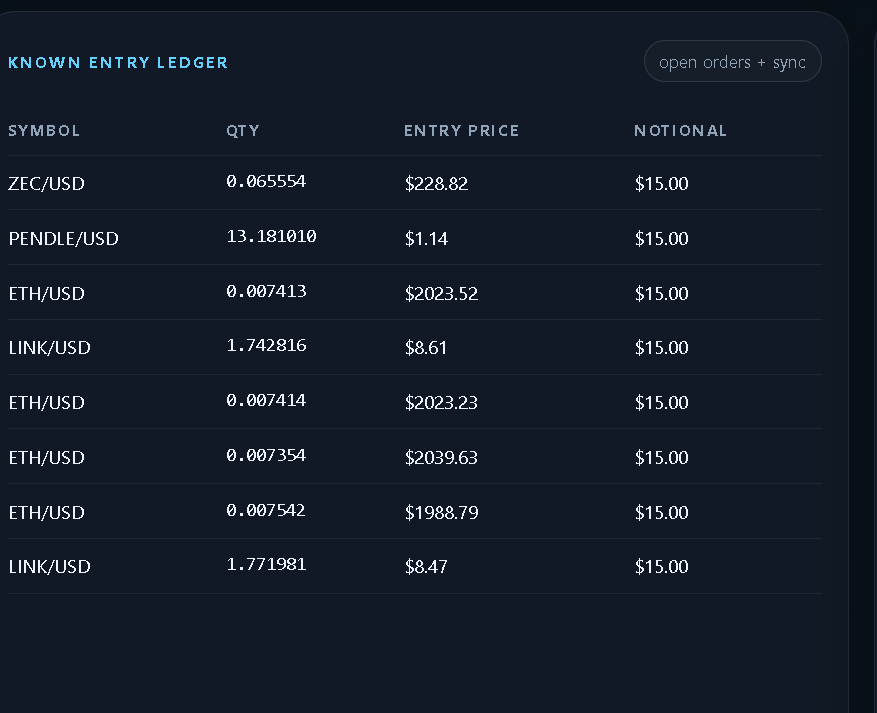
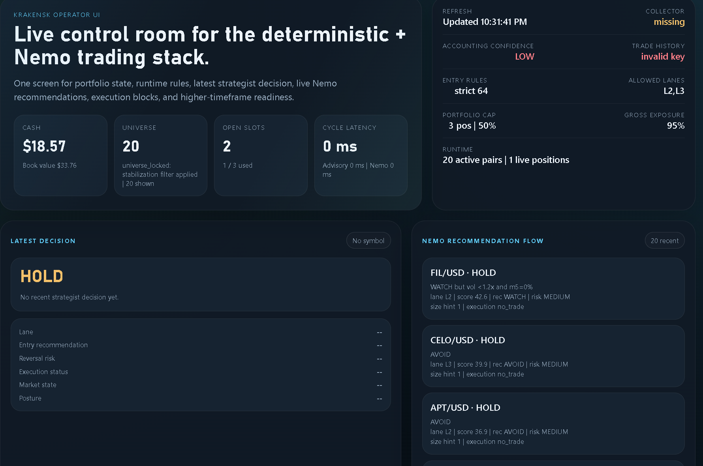
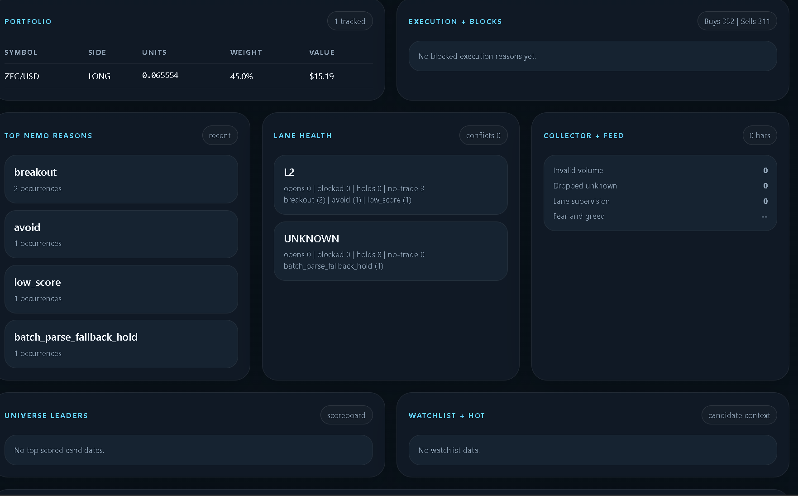
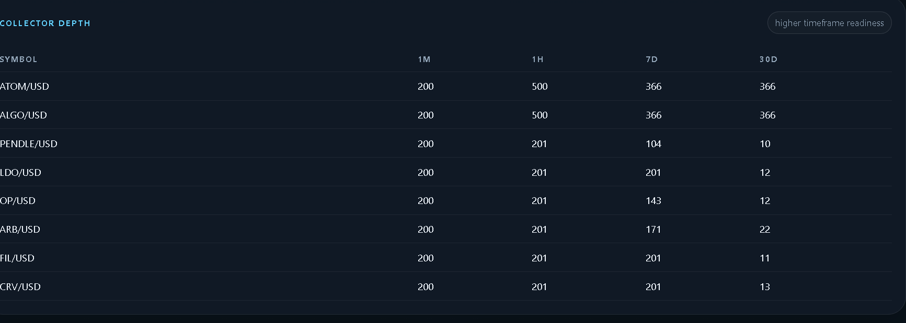

# KrakenSK

Operating objective: maximize high-quality wins while protecting capital. The target is not "always win" because no live market system can guarantee that; the target is disciplined execution with a validated path toward winning a high share of selected trades, aiming for 80%+ only when supported by replay, shadow, and live evidence. The system should also learn the way a strong human operator does: review outcomes, keep what works, cut what fails, and tighten behavior over time without moving deterministic truth into prompts.

KrakenSK is a live crypto trading system built around a deterministic trading core. The current shipped live adapter is Kraken-first, but the architecture is intended to support API-key exchange integrations more generally:
- symbol-local feature computation (GPU-accelerated via custom CUDA kernels)
- lane-aware scanning and promotion
- lane-aware execution
- state-based position management
- hard runtime health and risk gates
- replay and shadow validation before live change

LLMs are still present, but they are constrained. The intended direction is not "AI decides everything." The intended direction is a measurable leader-rotation engine with AI used for review, diagnosis, and structured advisory.

## Build Attribution

This repository was developed through human-directed implementation with assistance from multiple coding and reasoning systems, including OpenAI Codex/ChatGPT and Claude, alongside direct operator iteration.

AI tools contributed to code generation, refactors, diagnostics, documentation, and testing support. Final runtime decisions, deployment choices, exchange credentials, and live-operation responsibility remain with the operator.

## Risk Disclaimer

This repository is not financial advice. The author/operator is not a financial advisor.

Use this system, its code, configuration, ideas, and documentation at your own risk. Live trading can lose money, fail operationally, or behave differently than replay, shadow, or paper testing.

## Third-Party Notice

This repository integrates third-party services, runtimes, and model endpoints, including NVIDIA-hosted APIs/models when configured. Those third-party components remain the property of their respective owners.

This project is not selling NVIDIA software, models, or services as proprietary first-party assets. KrakenSK is an integration and orchestration layer that can call third-party providers when the operator configures them.

You are responsible for:
- complying with the license and terms of any third-party model, API, or binary you use
- supplying your own credentials where required
- reviewing provider usage limits, commercial terms, and attribution requirements before deployment

## What This Repository Contains

This repository includes:
- a live exchange trading loop with a current Kraken-first adapter
- a universe manager that selects and ranks tradable symbols
- deterministic feature extraction, scoring, and risk gating
- optional local LLM services for advisory and finalist review
- a web-based operator UI for runtime monitoring
- replay, shadow validation, and review tooling
- a large supporting doc set for architecture, tuning, runtime flow, and operating rules

If you are reading this on GitHub, start with this README, then use the full docs index in [docs/DOCS_INDEX.md](docs/DOCS_INDEX.md).

## UI Screenshots

Operator UI examples from the current stack:









## System Requirements

### Required

- Windows with PowerShell support
- Python `3.11+` as defined in [pyproject.toml](pyproject.toml)
- An exchange account and API credentials for live trading
- Network connectivity to the configured exchange REST and WebSocket endpoints
- Enough local disk for logs, state, and optional research outputs

### Recommended Runtime Shape

- Windows 11
- Intel Core Ultra 7 / modern Ryzen 7 class CPU or better
- 32 GB RAM recommended
- Local Ollama runtime for Nemotron/local strategist paths
- CUDA-capable NVIDIA GPU recommended for the accelerated feature stack in [`cpp/src`](cpp/src)
- NVIDIA RTX 16 GB VRAM class GPU recommended for local CUDA/model workflows
- 1 TB+ SSD recommended for logs, models, research outputs, and replay data
- Optional Intel/NPU or OpenVINO setup if you want Phi-3 or visual Phil locally
- A second monitor or large desktop layout for the operator UI while the stack is live

Reference operator machine used during active development:
- Windows 11 Home `10.0.26200`
- Intel Core Ultra 7 265F
- 32 GB RAM
- NVIDIA GeForce RTX 5060 Ti
- 16 GB dedicated VRAM
- 1.8 TB SSD
- 3440x1440 ultrawide display

### Python Dependencies

Base dependencies are declared in [pyproject.toml](pyproject.toml):
- `python-dotenv`
- `httpx`
- `pydantic`
- `pandas`
- `numpy`
- `fastapi`
- `mcp`
- `uvicorn`
- `websockets`

Optional dependency groups:
- `dev`
- `ml`
- `research`

### External Services And Binaries

Depending on your runtime mode, you may also need:
- live API access for your configured exchange
- Ollama
- local Nemotron model availability
- Phi-3 service or OpenVINO-exported Phi-3 assets
- Cloudflared if you expose MCP publicly

### Hardware Notes

The repository can be explored and tested without a full production workstation, but the intended live shape assumes:
- a machine stable enough to run collector, trader, universe manager, and review scheduler continuously
- enough CPU and memory for pandas/numpy feature computation and local services
- optional GPU/NPU acceleration if you want the full local model and CUDA feature path

This project is not a toy script. Treat it like a small trading platform.

## Current Runtime

The normal app stack started by [`scripts/start_all.ps1`](scripts/start_all.ps1) is:
- `universe_manager`
- `review_scheduler`
- `trader`
- optional `visual_phil`
- optional `visual_feed`
- optional `operator_ui`

Persistent AI services are started separately with [`scripts/start_models.ps1`](scripts/start_models.ps1):
- `ollama` when `NEMOTRON_PROVIDER=local`
- optional Phi-3 services only when `ADVISORY_MODEL_PROVIDER=phi3`

**Important:** Run `start_models.ps1` first and wait for "Phi-3 ready" before running `start_all.ps1`. Phi-3 takes 2-3 minutes to load on NPU — `start_all.ps1` only waits 15 seconds.

Current note: the recommended runtime is `ADVISORY_MODEL_PROVIDER=local_nemo`, `NEMOTRON_PROVIDER=local`, `NEMOTRON_STRATEGIST_PROVIDER=local`, and `NEMOTRON_BATCH_MODE=false`. In that setup, Phi-3 readiness is not required.

Current reference docs:
- [LLM operating model](docs/llm_operating_model.md)
- [Entry/exit research](docs/entry_exit_research.md)
- [Trading playbook](docs/trading_playbook.md)
- [Runtime cycle](docs/runtime_cycle.md)
- [Funding readiness checklist](docs/funding_readiness_checklist.md)
- [North Star runtime baseline](docs/northstar_runtime_baseline.md)
- [Full docs index](docs/DOCS_INDEX.md)

### Docs Map

- [README.md](README.md): front door - what the project is, how it runs, and where to look next
- [Full docs index](docs/DOCS_INDEX.md): complete documentation directory with all major docs grouped by purpose
- [Trading playbook](docs/trading_playbook.md): how the system should trade in practice
- [Runtime cycle](docs/runtime_cycle.md): what the live system actually does on startup and during each decision cycle
- [Entry/exit research](docs/entry_exit_research.md): where entry and exit behavior actually live in code and config
- [LLM operating model](docs/llm_operating_model.md): what Nemo/advisory are allowed to do and what code still owns
- [North Star runtime baseline](docs/northstar_runtime_baseline.md): target runtime shape and recommended operating profile
- [Funding readiness checklist](docs/funding_readiness_checklist.md): pass/fail checklist for whether the system is ready for more capital

## Adjust To Your Own Settings

Do not copy this repository into live trading unchanged.

Before you run your own stack, adjust:
- `.env` for your API keys, model providers, ports, and runtime mode
- [`configs/runtime_overrides.json`](configs/runtime_overrides.json) for entry strictness, risk sizing, exposure limits, and lane behavior
- [`pair_pool_usd.txt`](pair_pool_usd.txt) for the universe you actually want to trade
- `MEME_SYMBOLS`, `UNIVERSE_MAJOR_BASES`, and excluded symbols/bases for your own symbol classification
- local model endpoints and model names if your Ollama/OpenVINO setup differs
- `PORTFOLIO_MAX_OPEN_POSITIONS`, exposure caps, and risk per trade to fit your account size

If you are not ready for live mode:
- use replay first
- use shadow validation next
- keep `.env` pointed away from real live credentials until the runtime is clean

The live engine entrypoint is [`apps/trader/main.py`](apps/trader/main.py).

## Core Design

Current target architecture:
1. normalized market/account inputs
2. symbol-local feature computation
3. lane-aware candidate evaluation
4. deterministic promotion ladder: `skip`, `probe`, `promote`
5. deterministic risk and portfolio gating
6. lane-aware order policy
7. position state machine: `RUN`, `STALL`, `WEAKEN`, `FAIL`, `ROTATE`
8. replay and shadow validation before any live runtime mutation

Important current behavior:
- weak symbols no longer flatten batch features for strong symbols
- trader-loop evaluation is symbol-local rather than batch-fragile
- `vol_low` is a participation-aware downgrade, not a hard kill — structure + momentum overrides it
- promotion is explicit instead of spread across soft veto layers
- runtime health can hard-block trading on stale or invalid state
- optimizer/runtime advice is staged, not applied live by default

## GPU Feature Pipeline

All indicator computation runs on GPU via custom CUDA kernels (`cpp/src/`):

| Kernel | What it computes |
|---|---|
| `cuda_rsi` | **Wilder's RSI** (RMA-smoothed, matched against exchange-standard / TradingView-style reference behavior) |
| `cuda_atr` | Average True Range over lookback window |
| `cuda_bollinger` | Bollinger Bands — middle, upper, lower, bandwidth |
| `cuda_features` | Momentum, volatility |
| `cuda_correlation` | Full correlation matrix across universe |
| `cuda_northstar` | Hurst exponent, Shannon entropy, autocorrelation |

All kernels use `double` (float64) precision throughout. No `--use_fast_math`.

### Wave 1 Advanced Features (batch pipeline)

Computed in [`core/features/batch.py`](core/features/batch.py) and passed through to entry scoring:

- **MACD** (12/26/9 EMA) + histogram — trend confirmation signal
- **ADX** (Wilder smoothing, 14-period) — trend strength; <20 = ranging/chop, >25 = confirmed trend
- **VWIO** (Volume Weighted Imbalance Oscillator) — `EMA(buy_vol - sell_vol, 10) / EMA(vol, 10)`, bounded [-1, +1]; detects directional volume pressure
- **OBV Divergence** — bearish: price up / OBV down (distribution); bullish: price down / OBV up (accumulation); wired directly into `reversal_risk`

### Wave 2 Structure Features (lane-aware, multi-timeframe)

Computed in `_compute_structure_features()` inside [`core/features/batch.py`](core/features/batch.py). Run once per lane tier per cycle using the correct timeframe for that lane's hold style:

| Lane | Primary TF | Range TF | Range window | Zone | Use case |
|------|-----------|----------|--------------|------|----------|
| **L4** (meme) | 5m | 15m | 12 bars = 3h | 4 bars = 1h | Fast pumps, quick holds |
| **L2/L3** (swing/rotation) | 15m | 1h | 24 bars = 24h | 16 bars = 16h | Channel continuation, breakouts |
| **L1** (blue chip) | 1h | 1h | 72 bars = 3 days | 24 bars = 24h | Multi-day structure, longer holds |

Features per lane struct:

| Feature | What it detects |
|---|---|
| `ema9_above_ema20` | Bullish EMA stack (EMA9 > EMA20) |
| `price_above_ema20` | Price holding above structure |
| `ema_slope_9` | EMA9 rising or falling (3-bar slope) |
| `range_pos_1h` | 0–1: where price sits in the full range window |
| `range_pos_4h` | 0–1: where price sits in the zone window |
| `range_breakout_1h` | Closed above prior N bars' high — breakout confirmed |
| `higher_low_count` | # of last 10 bars with HL > prior HL — structure building |
| `pivot_break` | Closed above local pivot high (bars[-20:-2]) |
| `pullback_hold` | Touched EMA9 within 0.5% recently then recovered — cleanest entry |

`slice_features_for_asset` automatically selects `struct_l1`, `struct_l23`, or `struct_l4` based on the symbol's lane assignment.

### Kelly Criterion Position Sizing

[`core/memory/kelly_sizer.py`](core/memory/kelly_sizer.py) computes half-Kelly from exchange trade history when history is available:

```
f* = W - (1-W)/R    →    size = f* / 2
```

Separate calculation for standard vs meme pairs. Output clamped to `[KELLY_MIN_PCT, KELLY_MAX_PCT]` and written to `runtime_overrides.json`. Runs automatically before each optimizer cycle via `review_scheduler`.

Set `KELLY_ENABLED=false` to lock manual risk settings and prevent Kelly from overwriting them.

## Main Components

- [`apps/trader`](apps/trader): live trading loop, execution, exits, shadow comparison logging
- [`apps/universe_manager`](apps/universe_manager): active pair selection and lane metadata
- [`apps/review_scheduler`](apps/review_scheduler): optimizer review scheduling, Kelly sizing, staged override proposals
- [`apps/replay`](apps/replay): offline replay and baseline-vs-shadow comparison
- [`core/policy`](core/policy): entry verifier, lane logic, promotion ladder, Nemotron gating
- [`core/execution`](core/execution): order planning, mock/live execution
- [`core/risk`](core/risk): hard risk, runtime health, exits, position monitor
- [`core/llm`](core/llm): Phi-3 and Nemotron/OpenAI orchestration under contract-based outputs; behavior score
- [`core/state`](core/state): portfolio, position state, open orders, SQLite system record
- [`core/features`](core/features): GPU batch feature pipeline, CUDA kernel wrappers, structure features
- [`core/memory`](core/memory): trade memory, Kelly sizer, behavior score block builder
- [`core/validation`](core/validation): shared validation runner for replay and live shadow mode

## Decision Flow

Hot path for a tradable symbol:
1. collect latest bars, books, and account state
2. compute symbol-local features (GPU: RSI, ATR, Bollinger, momentum, Hurst, VWIO, OBV, MACD, ADX)
3. compute lane-aware structure features (EMA alignment, range position, breakout, higher lows, pullback hold)
4. classify lane and build deterministic entry verdict
5. assign promotion tier: `skip`, `probe`, `promote` — or `channel_breakout` / `channel_retest`
6. apply runtime health and hard-risk checks
7. run lane-aware execution policy
8. manage open positions through the position-state machine

LLM usage:
Current runtime note:
- advisory model: lightweight data-integrity and market-state review
- local `Nemo 9B` is the recommended advisory + strategist path during stabilization
- local strategist runs in compact finalist batch mode
- recommended local batch shape is top-5 finalists, not full-universe batch and not serial full-universe local calls
- local strategist receives a compact canonical candidate packet instead of the full wide packet
- `lesson_summary` is preferred over long lesson dumps
- `behavior_score` can still be provided, but local payloads should stay compact
- `Phi-3` (NPU): market-state scan, posture review, watchlist flagging — boosts entry_score for flagged symbols
- `Phi-3` pattern verifier: chart-structure and candle-context verification only; it helps Nemo judge finalists, but it does not make the final trade decision
- `Nemotron` / OpenAI: batch comparative strategist using full candidate table (score, lane, RSI, MACD, ADX, VWIO, net_edge, cost_pen, Phi-3 signal)
- `Nemotron` remains the final LLM trade judge on finalists, while deterministic code still owns legality, sizing, cost floors, and execution vetoes
- Nemo receives `learned_lessons` (per-symbol outcome history) and `behavior_score` (self-calibration data) each cycle
- no LLM is allowed to override hard risk
- runtime adjustment advice is staged for replay/shadow/human review

## Entry Scoring

[`core/policy/entry_verifier.py`](core/policy/entry_verifier.py) computes a 0–100 entry score per symbol:

- Base signals: momentum (5/14/30), rotation score, trend, volume ratio, volume surge, price z-score
- Book signals: imbalance, wall pressure
- Sentiment: market cap change, symbol trending
- Regime: 7d regime (trending/choppy), macro 30d (bull/bear), regime state (bullish/bearish/volatile)
- Structure: Hurst, autocorrelation, entropy, crowding
- Volume: VWIO (up to ±6 pts), OBV divergence (±5 pts + reversal_risk escalation)
- Channel structure (Wave 2): EMA alignment (+5), slope (±6), range position (±5), breakout (+6), higher lows (+4), pivot break (+4), pullback hold (+5)
- Lane-specific bonuses (L1/L2/L4 each have separate booster logic)
- **Phase 1 cost penalty** (Wave 3): execution cost is inlined into the pre-score before Nemo evaluation

`reversal_risk` (LOW / MEDIUM / HIGH) is computed separately and gates the final recommendation.

### Phase 1 — Cost Penalty In Pre-Score

After all signal scoring, `entry_verifier.py` computes execution cost inline and adjusts the score before Nemo ever sees the candidate:

| net_edge | Score adjustment | Reason tag |
|---|---|---|
| ≥ +1.0% | −5 pts (bonus) | `edge_strong` |
| ≥ 0.0% | 0 pts | — |
| ≥ −0.5% | −5 pts | `cost_marginal` |
| ≥ −1.0% | −10 pts | `cost_high` |
| < −1.0% | −15 pts | `cost_prohibitive` |

`net_edge = expected_edge_pct − total_cost_pct` where total cost = spread + round-trip fees + slippage ATR.

The score and full `point_breakdown` (spread_pct, total_cost_pct, expected_edge_pct, net_edge_pct, cost_penalty_pts) are passed downstream to Nemo.

### Promotion Paths

| Reason | What triggered it |
|---|---|
| `strong_buy_low_risk` | Score >= strong_buy threshold, reversal_risk=LOW |
| `buy_candidate` | Score >= buy threshold, reversal_risk != HIGH |
| `channel_breakout` | range_breakout_1h + EMA aligned + trend_1h >= 0 |
| `channel_retest` | pullback_hold + EMA aligned + trend_1h >= 0 |
| `watch_mover_probe` | WATCH with mover signal in L2/L4 or leader signal |

## Exit Controls

Key exit parameters (tuned above fee break-even):

| Setting | Value | Reason |
|---|---|---|
| `EXIT_ATR_TAKE_PROFIT_MULT` | 5.0 | Full TP target; primary TP fires earlier at 1.8× ATR |
| `EXIT_PRIMARY_TP_ATR_MULT` | 1.8 | First partial exit — locks in profit quickly |
| `EXIT_LIVE_RANK_DECAY_MIN_PNL_PCT` | 0.75% | Prevents exiting below fee threshold |
| `EXIT_LIVE_STALL_MIN_HOLD_MIN` | 30 min | Give trades breathing room |
| `STOP_MIN_HOLD_MIN` | 30 min | Prevent premature stop-outs |
| `EXIT_TRAIL_ARM_R` | 2.0R | Arm trailing stop after 2R gain |
| `EXIT_STALE_MIN_HOLD_MIN` | 45 min | L3 stale detection — exit stuck positions after 45 min |
| `EXIT_STALE_MAX_ABS_PNL_PCT` | 0.8% | Stale exit only fires if PnL is within ±0.8% (not running) |

## Dust Prevention

Positions below `ACCOUNT_DUST_USD_THRESHOLD` (default $5) are excluded from equity calculations and not traded. This prevents dust from inflating position sizing.

At each account sync, the dust sweep fires:
- Bot-tracked positions that fell below the threshold and are still above `EXEC_MIN_NOTIONAL_USD`: market sell (`dust_sweep` event)
- Below min notional (truly unsellable): removed from `positions_state` so they don't block open position slots (`dust_dropped` event)

Buy qty is floored (not rounded) at `lot_decimals` to prevent fractional remainder dust on exit.

Pre-existing dust from before the bot (tiny GRT, ADA, TRX amounts) is absorbed naturally when the bot next buys that coin — the full balance (dust + new position) is read from the exchange at exit time.

## Replay And Shadow Validation

Replay entrypoint: [`apps/replay/main.py`](apps/replay/main.py)

Replay supports:
- baseline engine replay: `classic` or `llm`
- optional shadow engine replay on the same bars
- comparison outputs: divergence count, divergence rate, PnL delta, trade delta

Example:

```powershell
python -m apps.replay.main --symbols BTC/USD ETH/USD --engine classic --shadow-engine llm
```

Live shadow validation is available in the trader loop with:
- `SHADOW_VALIDATION_ENABLED=true`
- `SHADOW_DECISION_ENGINE=classic|llm`

Shadow mode does not place live shadow trades. It evaluates the alternate engine on copied state and records comparisons only.

## Runtime Overrides

Runtime settings live in [`core/config/runtime.py`](core/config/runtime.py).

Live overrides come from:
- environment variables
- [`configs/runtime_overrides.json`](configs/runtime_overrides.json) (hot-reloaded, no restart needed)

Optimizer/runtime advice no longer writes directly to live runtime config by default.

New flow:
1. strategy/optimizer produces a proposal
2. proposal is staged in [`configs/runtime_override_proposals.json`](configs/runtime_override_proposals.json)
3. replay must pass
4. shadow validation must pass
5. human approval must be present
6. only then can the proposal be applied to live overrides

## System Of Record

Debug JSONL logs still exist, but the system also writes a durable SQLite record to:

- [`logs/system_record.sqlite3`](logs/system_record.sqlite3)

Current tables include:
- `decision_traces`
- `decision_debug`
- `fill_events`
- `outcome_reviews`
- `optimizer_reviews`
- `runtime_override_proposals`
- `replay_runs`
- `shadow_decisions`

This is the system of record for replay/shadow validation and runtime-change auditability.

## Key Environment

Common runtime controls in `.env`:
- `TRADER_DECISION_ENGINE=classic|llm`
- `SHADOW_VALIDATION_ENABLED=true|false`
- `SHADOW_DECISION_ENGINE=classic|llm`
- `ADVISORY_MODEL_PROVIDER=local_nemo|phi3`
- `NEMOTRON_PROVIDER=local|nvidia|openai`
- `NEMOTRON_STRATEGIST_PROVIDER=local|cloud|nvidia|openai`
- `NEMOTRON_BATCH_MODE=true|false`
- `NEMOTRON_BASE_URL=http://127.0.0.1:11434`
- `NEMOTRON_MODEL=mirage335/NVIDIA-Nemotron-Nano-9B-v2-virtuoso:latest`
- `MCP_PUBLIC_ENABLED=true|false`
- `MCP_PUBLIC_HOSTNAME=` named Cloudflare hostname, optional
- `MCP_TUNNEL_NAME=` named Cloudflare tunnel, optional
- `CLOUDFLARED_EXE=cloudflared`
- `OPENAI_API_URL=https://api.openai.com/v1`
- `OPENAI_MODEL=gpt-4.1-mini`
- `ACTIVE_MIN=20`
- `ACTIVE_MAX=30`
- `ROTATION_SHORTLIST_SIZE=30`
- `UNIVERSE_REFRESH_INTERVAL_MIN=2`
- `UNIVERSE_MIN_REFRESH_INTERVAL_MIN=5`
- `UNIVERSE_RETAIN_BUFFER_MULT=1.5`
- `MEME_UNIVERSE_ENABLED=false`
- `MEME_ACTIVE_UNIVERSE_MAX=1`
- `UNIVERSE_EXCLUDED_BASES=USDT,USDC,DAI,PYUSD,TUSD,FDUSD,USDE,USDS,USDP`
- `UNIVERSE_EXCLUDED_SYMBOLS=PAXG/USD`
- `UNIVERSE_MAJOR_BASES=BTC,XBT,ETH,SOL,XRP,ADA,TRX,AVAX,LINK,DOT,LTC`
- `UNIVERSE_METAL_BASES=PAXG,XAUT`
- `MEME_SYMBOLS=DOGE/USD,SHIB/USD,PEPE/USD,WIF/USD,BONK/USD,FARTCOIN/USD,TRUMP/USD,PENGU/USD,PUMP/USD,USELESS/USD,SPX/USD`
- `KELLY_ENABLED=false` — disable Kelly sizer to lock manual risk settings
- `ACCOUNT_DUST_USD_THRESHOLD=5.0` — positions below this are excluded from equity and not traded

Selected runtime controls:
- `PORTFOLIO_MAX_OPEN_POSITIONS`
- `PORTFOLIO_MAX_TOTAL_GROSS_EXPOSURE`
- `PORTFOLIO_MAX_POSITIONS_PER_SECTOR`
- `EXEC_RISK_PER_TRADE_PCT`
- `MEME_EXEC_RISK_PER_TRADE_PCT`
- `ORDER_PREFERENCE`
- `ORDER_POST_ONLY`
- `NEMOTRON_VERDICT_CACHE_TTL_SEC`
- `STABILIZATION_STRICT_ENTRY_ENABLED`
- `STABILIZATION_MIN_ENTRY_SCORE`
- `STABILIZATION_REQUIRE_TREND_CONFIRMED`
- `STABILIZATION_REQUIRE_SHORT_TF_READY_15M`
- `STABILIZATION_BLOCK_RANGING_MARKET`
- `STABILIZATION_REQUIRE_BUY_RECOMMENDATION`

Universe-specific controls:
- `MEME_UNIVERSE_ENABLED` blocks meme symbols at universe construction instead of relying on later-stage rejection
- `MEME_ACTIVE_UNIVERSE_MAX` caps meme slots inside the active universe
- `UNIVERSE_MIN_REFRESH_INTERVAL_MIN` sets a hard floor on universe refresh cadence
- `UNIVERSE_RETAIN_BUFFER_MULT` adds a retention band so incumbents do not churn on tiny rank moves
- `UNIVERSE_EXCLUDED_BASES` blocks whole base-asset classes
- `UNIVERSE_EXCLUDED_SYMBOLS` blocks exact symbols
- `UNIVERSE_MAJOR_BASES` and `UNIVERSE_METAL_BASES` define segmentation tags used by the universe manager

## Logs And State

Key outputs:
- [`logs/decision_traces.jsonl`](logs/decision_traces.jsonl)
- [`logs/decision_debug.jsonl`](logs/decision_debug.jsonl)
- [`logs/shadow_decisions.jsonl`](logs/shadow_decisions.jsonl)
- [`logs/nemotron_debug.jsonl`](logs/nemotron_debug.jsonl)
- [`logs/outcome_reviews.jsonl`](logs/outcome_reviews.jsonl)
- [`logs/account_sync.json`](logs/account_sync.json)
- [`logs/open_orders.json`](logs/open_orders.json)
- [`logs/position_state.json`](logs/position_state.json)
- [`logs/system_record.sqlite3`](logs/system_record.sqlite3)

## Local Start / Stop

From the repo root:

```powershell
.\scripts\stop_all.ps1
.\scripts\start_models.ps1
.\scripts\start_all.ps1
```

To expose the MCP server publicly through Cloudflare, keep the MCP server local and enable the tunnel sidecar in `.env`:

```powershell
MCP_PUBLIC_ENABLED=true
CLOUDFLARED_EXE=cloudflared
```

Quick tunnel:

```powershell
.\scripts\start_mcp_tunnel.ps1
```

Named tunnel:

```powershell
MCP_PUBLIC_ENABLED=true
MCP_PUBLIC_HOSTNAME=your-mcp.example.com
MCP_TUNNEL_NAME=your-tunnel-name
```

For a trader-only restart without touching the rest of the stack:

```powershell
.\scripts\restart_trader.ps1
```

Use trader-only restart only for trader code or trader startup config changes. If you changed [`apps/universe_manager/main.py`](C:\Users\kitti\Desktop\KrakenSK\apps\universe_manager\main.py) or [`apps/collector/main.py`](C:\Users\kitti\Desktop\KrakenSK\apps\collector\main.py), do a full app restart so those processes reload too.

If PowerShell blocks scripts:

```powershell
powershell -ExecutionPolicy Bypass -File .\scripts\start_models.ps1
powershell -ExecutionPolicy Bypass -File .\scripts\start_all.ps1
powershell -ExecutionPolicy Bypass -File .\scripts\restart_trader.ps1
```

## Status

Core foundation:
- symbol-local features (GPU-accelerated)
- symbol-local trader evaluation
- participation-aware `vol_low` handling (structure + momentum overrides the veto)
- explicit promotion ladder
- lane-aware order policy
- dedicated position-state monitor
- runtime health risk gating
- staged runtime overrides
- SQLite system record
- replay and shadow validation stack

Wave 1 advanced features:
- MACD + ADX wired into Nemo batch table and entry scoring
- VWIO (Volume Weighted Imbalance Oscillator) in entry scoring
- OBV divergence wired into `reversal_risk`
- Kelly Criterion dynamic position sizing from live trade history (KELLY_ENABLED=false to lock manual settings)
- Wilder's RSI in CUDA kernel (matched against exchange-standard / TradingView-style reference behavior)
- Exit thresholds tuned above fee break-even (0.52% round-trip)

Wave 2 structure features:
- Lane-aware channel continuation detection (L4=5m, L2/L3=15m, L1=1h)
- EMA9/EMA20 alignment, slope, range positioning, breakout confirmation
- Higher low count, pivot break, pullback hold (retest entry)
- `channel_breakout` and `channel_retest` promotion paths bypass top-candidate gate
- Dust prevention: $5 threshold, equity exclusion, floor rounding, sweep on exit
- Book validity fix: partial exchange book updates no longer zero out bid/ask

Wave 3 — point system, self-calibration, and composite scoring:
- **Phase 1** cost penalty inlined into `entry_verifier.py`: net_edge tiers adjust score −15 to +5 pts before Nemo sees candidates
- **Phase 2** `net_edge` and `cost_pen` columns injected into every Nemo batch row; system prompt rules teach Nemo how to act on them
- **Phase 3** AI Behavior Score ([`core/llm/behavior_score.py`](core/llm/behavior_score.py)): tracks Nemo's precision, capture quality, cost awareness, tail control, and regime quality across last 50 trades; score + threshold advice injected into each batch so Nemo self-calibrates entry strictness
- **Final score pipeline** ([`core/policy/final_score.py`](core/policy/final_score.py)): unified composite score per candidate combining entry_score + reflex_bonus + reliability_bonus + basket_fit_bonus + spread_penalty + cost_penalty + correlation_penalty (clamped 0–100); passed to Nemo as `final_score` + `score_breakdown`
- **Symbol reliability** ([`core/memory/symbol_reliability.py`](core/memory/symbol_reliability.py)): rolling 20-trade win rate per symbol with 5-min cache; feeds `reliability_bonus` (−10 to +8 pts) into final_score
- **Held correlation map**: live portfolio correlation wired into `basket_fit_bonus` — empty portfolio gets +6 free-slot bonus; correlated held positions reduce bonus toward 0
- **Volatility context bucket** in Nemo payload: Hurst exponent regime (trending/random/mean_reverting) + Bollinger Band squeeze state (tight_squeeze/normal/expanding)
- **Realized edge tracking**: `expected_edge_pct` stored at entry; `realized_edge_pct` and `edge_capture_ratio` written to `outcomes.jsonl` at close for self-calibration
- **15m VWRS universe ranking**: volume-weighted relative strength computed from 3×5m bars, subtracted against BTC; replaces simple 5h momentum differential
- **L3 stale detection** enabled: `EXIT_STALE_MIN_HOLD_MIN=45` + `EXIT_STALE_MAX_ABS_PNL_PCT=0.8` — was permanently disabled at default 99999
- **L4 meme gate tightened**: `MEME_NEMOTRON_GATE_MIN_ENTRY_SCORE=48` (was defaulting to 42, lower than standard 50); `volume_surge` bypass raised to 50%
- **Nemo entry gate actually enforced**: `NEMOTRON_GATE_MIN_ENTRY_SCORE` and `NEMOTRON_GATE_MIN_VOLUME_RATIO` were dead knobs — now wired at top of `passes_deterministic_candidate_gate()`
- **Elite setup rule**: Nemo batch prompt now has an explicit ELITE SETUP override — score ≥ 88 with any structure (ema/brk/pb/vol) bypasses the `m5 > 0` momentum gate
- **Cost floor relaxed**: `TRADE_COST_MIN_EDGE_MULT` lowered 2.5 → 1.5; the 2.5× requirement was blocking all entries in low-ATR/choppy sessions
- Universe volume gate lowered (`MIN_QUOTE_VOLUME_USD=50000`) to stop high-momentum low-cap coins from being blocked at universe construction
- Current recommended local runtime:
  - `ADVISORY_MODEL_PROVIDER=local_nemo`
  - `NEMOTRON_PROVIDER=local`
  - `NEMOTRON_STRATEGIST_PROVIDER=local`
  - `NEMOTRON_BATCH_MODE=true`
  - `NEMOTRON_BATCH_TOP_N=5`
- Startup now logs `trader_model_mode` so provider drift and effective batch mode are visible immediately
- Local strategist payloads are compacted from the canonical candidate packet before model send
